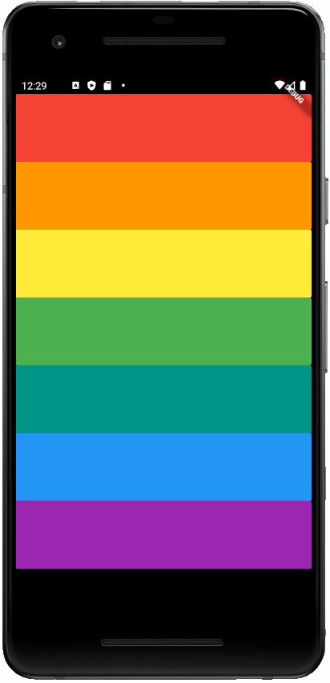

# Xylophone

This is a Flutter app I worked on following the starter code from the [Flutter Udemy course by Angela Yu](https://www.udemy.com/course/flutter-bootcamp-with-dart/).

Just another regular xylophone with seven notes.

## Skills Learned

* Flutter/Dart libraries
* Playing audio

## Screenshot

